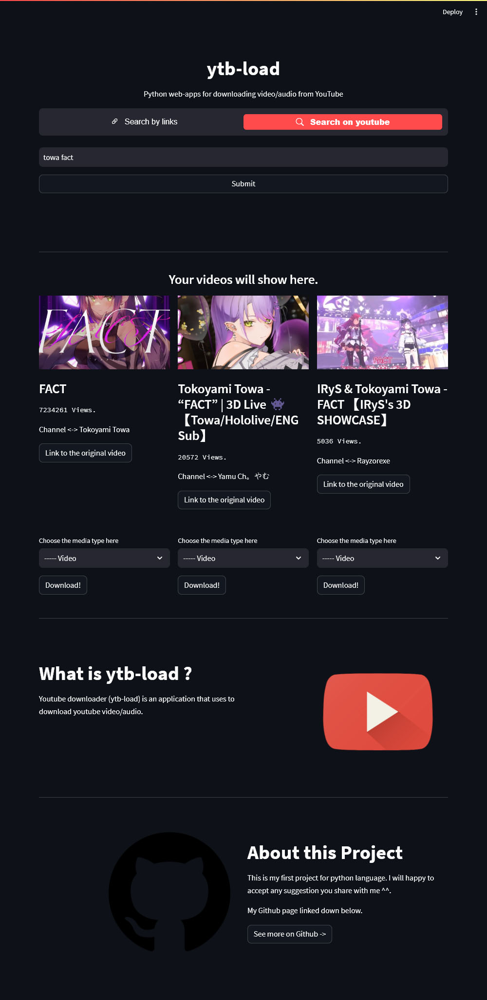

<div align="center">

<h4>Simple youtube downloader with live search.<h4>

 [](https://opensource.org/licenses/MIT)

</div>

## 1. What is ytb-load
ytb-load is a Youtube Downloader that mainly using python for programming language, and pytube for the packages.

## Overview


## Getting Started

1. Download the release from [here](https://github.com/d1azdn/pytube-ytdownloader/releases/)

2. Download the `requirements.txt`
```sh
pip3 install -r requirements.txt
```

3. Run the code by putting this command on your CLI
```sh
streamlit run main.py
```

4. Done and enjoy

## Edits
If you want to download separate for the video and audio, you can change this on `main.py`. 

```sh
<main.py, line 73>
if var == list(choose.keys())[loop] and var != "Mp3":
    stream = ytb(input['link']).streams.get_by_itag(list(choose.values())[loop])
    # streamSound = ytb(input['link']).streams.get_by_itag(140)

    print("Downloading the video...")
    stream.download(filename=f"outputs/{input['title']}.mp4")

    # print("Downloading the Audio...")
    # streamSound.download(filename="Audio.mp3")

    # print("Combining the pieces...")
    # convert.combine_audio("Video.mp4", "Audio.mp3", f"outputs/{input['title']}.mp4")
```

## Meta
Diaz Saputra - diazsaputramc@gmail.com
Distributed under the MIT License, see `LICENSE` for more information
[https://github.com/d1azdn/](https://github.com/d1azdn/)

# Clone
Clone this project

```sh
git clone -b [tag-name] https://github.com/d1azdn/pytube-ytdownloader
```