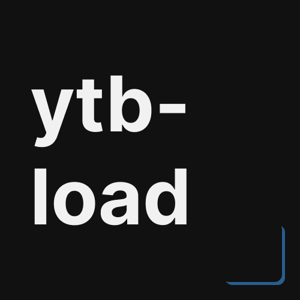

<div align="center">
  
  
  <h3><b>ytb-load</b></h3>
</div>

# 📗 Table of Contents
- [📖 About the Project](#about-project)
  - [⚙️ Production (done)](#production)
    - [Tech Stack](#tech-stack)
    - [Key Features](#key-features)
  - [🚀 Live Demo](#live-demo)
- [💻 Getting Started](#getting-started)
  - [Prerequisites](#prerequisites)
  - [Installation](#installation)
  - [Usage](#usage)
  - [Note](#note)
- [🤝 Contributing](#contributing)
- [📝 License](#license)

<br>


# 📖 ytb-load <a name="about-project"></a>
**ytb-load** is a comprehensive YouTube downloader, developed using Python as the core programming language. The project uses Pytube library, a powerful package designed for downloading of YouTube videos. By utilizing this combination of Python, Pytube and Streamlit, ytb-load offers users a streamlined and efficient solution for downloading content directly from YouTube with minimal complexity.

## ⚙️ Production (done)<a name="production"></a>
This project progressed over the **course of two week** before its public release, following several key stages: design planning phase, creating a functional layout using Streamlit, coding development stage, and finally pushing the completed code to GitHub.

### Tech Stack <a name="tech-stack"></a>
- Basic Python usage.
- Streamlit for python front-end use.
- (pytube) python package for python youtube API.
### Key Features <a name="key-features"></a>
- **Navigation**: Navigation system that adjusts based on user's interactions.
- **Minimalist Design**: Utilizes basic Streamlit web usage for a clean and intuitive design.
- **Search Functionality**: Provides a search bar that allows users to quickly find youtube content.
- **Data Fetching**: Fetches and displays real-time data from external APIs.
<p align="right">(<a href="#readme-top">back to top</a>)</p>


## 🚀 Live Demo <a name="live-demo"></a>
Sadly, this project is **not available** on any website. But you can make it live using **Streamlit live website**, or create local copy on your own.
<p align="right">(<a href="#readme-top">back to top</a>)</p>


## 💻 Getting Started <a name="getting-started"></a>
To get a local copy up and running, follow these steps.

### Prerequisites
- Clone this project at your directory.
```sh
git clone https://github.com/d1azdn/ytb-load
```

### Install
- Install the requirements.
```sh
pip3 install -r requirements.txt
```

### Usage
- To run the project, execute the following command:
```sh
streamlit run main.py
```


### 📝 Note <a name="note"></a>
If you want to download separate for the video and audio, you can change this on `main.py`. 

```sh
<main.py, line 73>
if var == list(choose.keys())[loop] and var != "Mp3":
    stream = ytb(input['link']).streams.get_by_itag(list(choose.values())[loop])
    # streamSound = ytb(input['link']).streams.get_by_itag(140)

    print("Downloading the video...")
    stream.download(filename=f"outputs/{input['title']}.mp4")

    # print("Downloading the Audio...")
    # streamSound.download(filename="Audio.mp3")

    # print("Combining the pieces...")
    # convert.combine_audio("Video.mp4", "Audio.mp3", f"outputs/{input['title']}.mp4")
```
<p align="right">(<a href="#readme-top">back to top</a>)</p>


## 🤝 Contributing <a name="contributing"></a>
Contributions, issues, and feature requests are welcome!
Feel free to check the [issues page](../../issues/).
<p align="right">(<a href="#readme-top">back to top</a>)</p>


## 📝 License <a name="license"></a>
This project is [MIT](./LICENSE) licensed.

_NOTE: we recommend using the [MIT license](https://choosealicense.com/licenses/mit/) - you can set it up quickly by [using templates available on GitHub](https://docs.github.com/en/communities/setting-up-your-project-for-healthy-contributions/adding-a-license-to-a-repository). You can also use [any other license](https://choosealicense.com/licenses/) if you wish._

<p align="right">(<a href="#readme-top">back to top</a>)</p>
